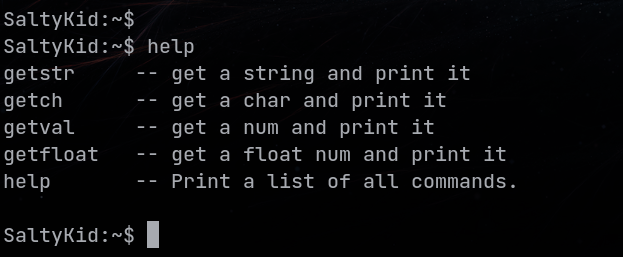
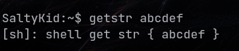
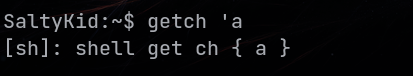
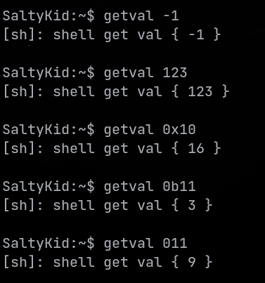
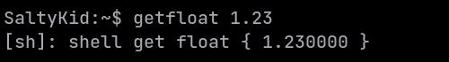

# LiteShell 0.1.0

## 一、功能概述
LiteShell 提供了一个简单的命令行交互功能，占用资源少，使用简单灵活，满足对嵌入式MCU调试维护的需求。

## 二、Api说明

### 1. 命令接收函数
该函数支持命令整行输入、单一字节输入等，接收到的字符会先存储在lite shell的缓存中，只有在接收完一整行命令时，才会置位命令解析标志。
```c 
/******************************************************************************
 * @brief        lite handler
 *
 * @param[in]    data_buf: recv_data to exec
 *
 * @param[in]    data_len: recv_data length
 *
 * @return       None
 ******************************************************************************/
void shell_handler(const char *data_buf, uint32_t data_len);

```

### 2. 命令解析处理函数(lite shell 主函数 需周期调用)
在命令解析标志置位时，会遍历lite shell的字符串缓冲区，将每个命令、参数逐一解析，之后会按照命令名称查找回调函数进行执行处理。所有的命令均在该函数执行时调用。
```c
/*******************************************************************************
 * @brief        lite shell main processing function
 *
 * @param[in]    None
 *
 * @return       None
 ******************************************************************************/
void shell_main_task(void);

```
### 3. 参数格式化解析函数
该函数目前支持自动解析正负数、小数、二进制数、八进制数、十六进制数、字符、字符串等，默认返回值均为size_t类型，需要用户进行强制类型转换使用。注：如果目标参数为字符串，则返回字符串首地址。
```c
/******************************************************************************
 * @brief        parse args
 *
 * @param[in]    p_arg: a point to args to be resolved
 *
 * @return       (size_t) parsed result
 ******************************************************************************/
size_t shell_arg_parse(char *p_arg);

```

## 三、使用说明

### 1. 可选配置 (参考 lite_shell_cfg.h.bak)
以下内容均可选，如不定义则使用默认值

```c
#define CONFIG_SHELL_MAX_LINE_LEN 128       /*!< 一条命令最大的字符长度 */
#define CONFIG_SHELL_MAX_ARG_LEN  8         /*!< 命令、参数 最大字符长度，超过该长度，命令、参数将被截取 */
#define CONFIG_SHELL_MAX_ARGS_NUM 5         /*!< 命令及参数最大支持个数 */
#define CONFIG_SHELL_USER_NAME    "SaltyKid:" /*!< 命令行标识名称 */

#define SHELL_LOG(fmt, args...)     LOG("[sh]: " fmt, ##args)  /*!< 建议用户使用的 log 函数 */
#define SHELL_DISPLAY(fmt, args...) LOG(fmt, ##args)  /*!< lite shell 内部使用的打印函数，无任何格式化内容 */

```

### 2. 命令添加说明 (参考 lite_shell_cfg.c.bak)
注意 shell_command_list 最后一个成员 要为 NULL

```c
/*!< Step 1: 定义 回调函数 */
/******************************************************************************
 * @brief        shell test str (ex: getstr asdf )
 *
 * @param[in]    None
 *
 * @return       None
 ******************************************************************************/
static void shell_test_str(int argc, char *argv[])
{
    (void)argc;
    SHELL_LOG("shell get str { %s }\r\n", (char *)shell_arg_parse(argv[1]));
}

/*!< Step 2: 添加 命令 回调函数 描述信息 */
const SHELL_CMD_TYPE_ST shell_command_list[] = {
    {"getstr", shell_test_str, "get a string and print it"},
    {(void *)0, (void *)0, (void *)0},
};
```

### 3. 使用示例

- help 显示命令列表 <br>


- 字符串解析 <br>


- 字符解析 <br>


- 数字解析 <br>


- 浮点数解析 <br>

